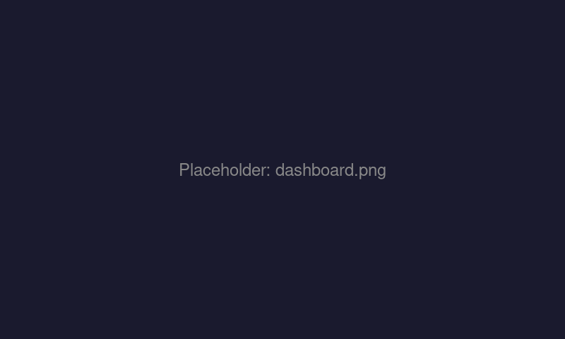
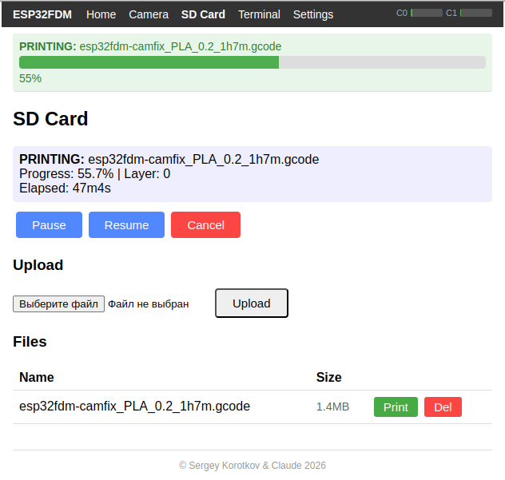
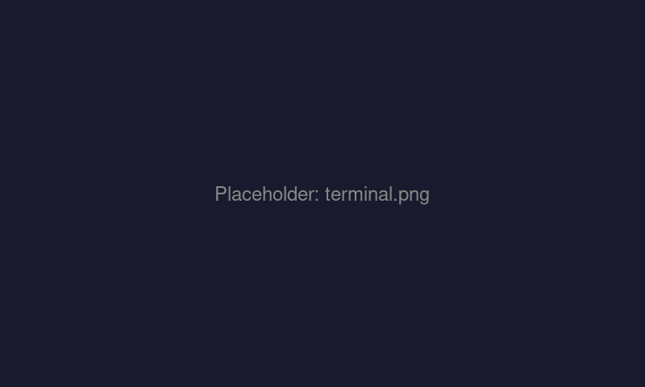
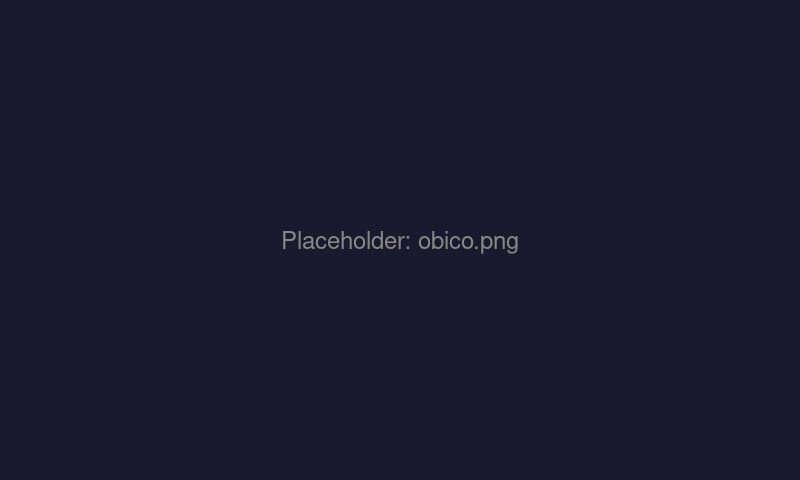

# ESP32 FDM Bridge

A WiFi-to-printer bridge firmware for generic **ESP32-S3 camera modules** (Freenove ESP32-S3-WROOM and compatible clones), turning a ~$7 microcontroller into a full-featured wireless print server with camera monitoring and cloud AI failure detection — at a fraction of the cost of a Raspberry Pi setup.

## Why This Exists

Traditional wireless 3D printing setups require a single-board computer (Raspberry Pi ~$50-75), a USB webcam (~$20-30), an SD card, a power supply, and software installation (OctoPrint, Klipper, etc.). Total cost: **$80-120+**, plus ongoing maintenance of a full Linux system.

This project replaces all of that with a **single ~$7 ESP32-S3 board** that has everything built in:

| | Raspberry Pi Setup | ESP32 FDM Bridge |
|---|---|---|
| **Cost** | $80-120+ | ~$7 |
| **Hardware** | SBC + camera + PSU + case | Single board |
| **Setup** | OS install, SSH, packages | Flash and go |
| **Boot time** | 30-60 seconds | ~3 seconds |
| **Power** | 5W+ | <1W |
| **Camera** | Separate USB webcam | Built-in OV2640/OV3660 |
| **USB Host** | Native | OTG port |

The ESP32-S3's dual cores, 8MB PSRAM, and native USB OTG make it powerful enough to handle simultaneous MJPEG streaming, printer communication, and cloud connectivity — all in real time.

## Screenshots

| Dashboard | SD Card Printing |
|---|---|
|  |  |

| GCode Terminal | Obico Integration |
|---|---|
|  |  |

## Web Installer

Flash the firmware directly from your browser — no tools or setup required:

**[Open Web Installer](https://sergeyksv.github.io/esp32fdm/)**

Requires Chrome or Edge (Web Serial API). Connect the board via the **right USB-C port** (UART).

## Features

### Camera & Streaming
- **MJPEG stream** at 5 FPS (800x600 JPEG) — works with OctoPrint, Obico, and any browser
- **Snapshot endpoint** for timelapse and AI analysis
- **WebRTC streaming** via optional Janus proxy sidecar for low-latency viewing through Obico

### Printer Communication
- **USB Host serial bridge** — connects to any Marlin or Klipper printer via USB
- Supports **CDC-ACM** and popular VCP chips: **CH34x, CP210x, FTDI FT23x**
- **Marlin backend**: direct serial with auto-report parsing, temperature tracking, SD print progress, layer detection
- **Klipper backend**: HTTP API to Moonraker — full status, control, and object queries
- Runtime backend switching (Marlin/Klipper) via web UI

### Cloud Integration (Obico)
- **AI failure detection** — periodic JPEG snapshots analyzed server-side for spaghetti, layer shifts, etc.
- **WebSocket status** — live printer state pushed to Obico cloud (or self-hosted)
- **Remote monitoring & control** — view camera, check progress, pause/cancel from anywhere
- **WebRTC video** — optional low-latency streaming through Janus gateway sidecar
- **Simple linking** — 6-digit code pairs the device with your Obico account
- Works with [app.obico.io](https://app.obico.io) or self-hosted Obico server

### OctoPrint Compatibility
- **RFC 2217 Telnet serial bridge** — OctoPrint connects via `rfc2217://<ip>:2217`
- Camera endpoints work directly with OctoPrint's webcam settings
- Zero-config: just add the IP address

### SD Card & Printing
- **On-board SD card** file management — upload, download, delete via web UI
- **Marlin**: host-based GCode streaming from SD with line numbering, checksums, and resend handling
- **Klipper**: uploads from SD to Moonraker with size-based dedup (skips if unchanged), auto-deletes previous upload to prevent storage bloat
- **GCode scan cache** — file metadata (layers, time, filament, thumbnail) cached on flash so repeated prints load instantly instead of re-scanning
- Pause, resume, and cancel work with both backends

### Web Terminal (Marlin only)
- **Browser-based GCode terminal** — send commands and see raw printer responses
- Auto-locked during prints to prevent interference
- Hidden when Klipper backend is selected (use Mainsail/Fluidd instead)

### WiFi & Configuration
- **Auto AP fallback** — if WiFi credentials are missing or connection fails, the board creates its own access point (`ESP32FDM-XXXX`) with a captive portal for setup
- All settings configurable via web UI — no reflashing needed
- NVS-persisted configuration survives reboots

### Web Dashboard
- Real-time temperature display (hotend + bed, actual/target)
- **Temperature history graph** — 1 hour of data, auto-refreshing canvas chart
- Print progress bar with layer count, elapsed time, and ETA
- Live camera snapshot (auto-refreshing)
- Responsive nav: Home, Camera, SD Card, Terminal (Marlin only), Settings

## Hardware

### Target Board: ESP32-S3 Camera Module

Developed on the **Freenove ESP32-S3-WROOM**, but works with compatible clones that share the same pin layout (many generic ESP32-S3-CAM boards on AliExpress/Amazon are near-identical). Some clones may require holding a BOOT button during flashing. Required features:

- **ESP32-S3** dual-core with **8MB PSRAM** (OPI) and **16MB flash**
- **OV2640 or OV3660 camera** on DVP bus
- **SD card slot** (1-bit SDMMC on GPIO 38/39/40)
- **Two USB-C ports:**
  - **Right:** UART bridge — for flashing and debug console
  - **Left:** ESP32-S3 native USB (GPIO 19/20) — **OTG Host to printer**

> **Note:** The OTG port may not supply 5V VBUS. If your printer doesn't enumerate, use a powered USB hub between the ESP32 and the printer.

### Pinout

| Function | GPIOs |
|---|---|
| Camera DVP | D0-D7: 11,9,8,10,12,18,17,16 |
| Camera control | XCLK:15, SIOD:4, SIOC:5, VSYNC:6, HREF:7, PCLK:13 |
| SD card | CLK:39, CMD:38, D0:40 |
| USB OTG | D+:20, D-:19 |

## Build & Flash

Requires [ESP-IDF v5.4](https://docs.espressif.com/projects/esp-idf/en/v5.4/esp32s3/get-started/index.html).

```bash
source ~/esp/esp-idf/export.sh
idf.py set-target esp32s3
idf.py menuconfig   # Set WiFi SSID/password under "ESP32 FDM Bridge Configuration"
idf.py build
idf.py -p /dev/ttyUSB0 flash monitor
```

Or skip `menuconfig` entirely — on first boot with no saved credentials, the board starts in AP mode with a captive portal for WiFi setup.

## Configuration

### Web UI (recommended)

After connecting to WiFi, open `http://<esp32-ip>/settings` to configure:

- **Camera** — rotation, stream/snapshot URLs
- **Printer** — backend (Marlin/Klipper), Moonraker host:port, pause command (M25 vs M524, Marlin only)
- **Obico** — link device with 6-digit code
- **WiFi** — reset credentials (triggers AP mode on reboot)

### Menuconfig

Additional compile-time options under `ESP32 FDM Bridge Configuration`:

| Option | Default | Description |
|---|---|---|
| WiFi SSID / Password | — | Initial credentials (overridden by NVS after AP setup) |
| Printer Baud Rate | 115200 | USB serial baud rate |
| Obico Server URL | `https://app.obico.io` | Cloud or self-hosted server |
| Snapshot Interval (printing) | 10s | JPEG upload frequency during prints |
| Snapshot Interval (idle) | 120s | JPEG upload frequency when idle |
| WebSocket Status Interval | 30s | Status push frequency |
| Janus Proxy Host/Port | disabled | Sidecar for WebRTC streaming |
| RFC 2217 Port | 2217 | Telnet serial bridge port |

## OctoPrint Setup

```
Settings → Webcam & Timelapse:
  Stream URL:   http://<esp32-ip>/stream
  Snapshot URL: http://<esp32-ip>/capture

Settings → Serial Connection → Additional serial ports:
  rfc2217://<esp32-ip>:2217

Connection panel:
  Port: rfc2217://<esp32-ip>:2217
  Baudrate: 115200
```

## Obico Setup

1. Create an account at [app.obico.io](https://app.obico.io) (or your self-hosted instance)
2. Open `http://<esp32-ip>/settings` and find the Obico section
3. Click "Link" and enter the 6-digit code from the Obico app
4. Done — snapshots upload automatically, AI detection starts on next print

For WebRTC streaming (optional), run the Janus proxy sidecar on a Linux machine on the same network. See `janus_proxy/` for details.

## HTTP API

| Endpoint | Method | Description |
|---|---|---|
| `/` | GET | Dashboard |
| `/camera` | GET | Full-screen MJPEG stream |
| `/stream` | GET | Raw MJPEG multipart stream |
| `/capture` | GET | Single JPEG snapshot |
| `/terminal` | GET | GCode terminal |
| `/terminal/send` | POST | Send GCode command |
| `/terminal/poll` | GET | Poll for new printer output |
| `/sd` | GET | SD card file manager |
| `/sd/files` | GET | JSON file listing |
| `/sd/upload` | POST | Upload file to SD |
| `/sd/print` | POST | Start host print |
| `/sd/pause` | POST | Pause print |
| `/sd/resume` | POST | Resume print |
| `/sd/cancel` | POST | Cancel print |
| `/api/status` | GET | JSON printer status |
| `/api/temp_history` | GET | Temperature history (1h, 4s intervals) |
| `/settings` | GET | Settings page |
| `/printer/config` | GET/POST | Printer backend config |
| `/obico/link` | GET/POST | Obico device linking |

## Architecture

```
Core 0: WiFi, HTTP server, RFC 2217, Obico WS/snapshot
Core 1: USB Host library, CDC-ACM/VCP driver (priority 20)

USB RX → printer_comm_rx_cb() → StreamBuffer → printer_comm_task (parser)
                                └→ terminal ring buffer → browser poll

Browser/Obico → printer_comm_send_cmd() → FreeRTOS queue → USB TX
```

## Project Structure

```
main/
  main.c               — Entry point, init sequence
  wifi.c/h             — STA + AP fallback with captive portal
  camera.c/h           — OV2640/OV3660 driver, Freenove pin mapping, triple-buffered PSRAM
  httpd.c/h            — HTTP server, dashboard, settings, camera pages
  usb_serial.cpp/h     — USB Host CDC-ACM + VCP drivers
  printer_backend.h    — Backend enum (Marlin/Klipper), avoids circular includes
  printer_comm.c/h     — Marlin serial protocol, state machine, host printing, temp history
  printer_comm_klipper.c/h — Klipper/Moonraker HTTP backend, file upload + print
  terminal.c/h         — Web serial terminal with ring buffer (Marlin only)
  sdcard.c/h           — SD card mount/unmount, file operations
  sdcard_httpd.c/h     — SD card web UI, backend-aware print/pause/resume/cancel
  cache.c/h            — LittleFS cache housekeeping (LRU eviction, mtime touch)
  obico_client.c/h     — Obico WebSocket, snapshot upload, Janus signaling
  rfc2217.c/h          — RFC 2217 Telnet COM-PORT-OPTION server (Marlin only)
  dns_server.c         — Captive portal DNS responder
  layout.h             — Shared HTML layout, nav bar (adapts to backend)
  Kconfig.projbuild    — Menuconfig options

janus_proxy/           — Python sidecar for WebRTC streaming via Obico
  proxy.py             — Main orchestrator
  janus_manager.py     — Janus gateway lifecycle
  signaling.py         — TCP ↔ Janus WebSocket bridge
  stream_worker.py     — MJPEG → UDP data channel injector
```

## License

MIT
